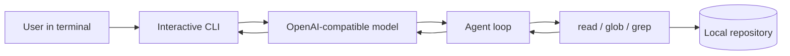

# mini-coding-agent

[](https://github.com/ruoyu-lu/mini-coding-agent/actions/workflows/ci.yml)

A small TypeScript coding-agent CLI for exploring a local repository through an OpenAI-compatible model. The published `main` branch currently exposes **read, glob and grep** tools; patching and command execution are not yet part of the released tool set.

## Why I built this

I wanted a compact place to understand the mechanics behind tool-calling agents: how model requests become bounded local tool calls, how tool failures return as observations, and how an interactive CLI maintains conversation state. Keeping the surface small makes the agent loop and its safety boundaries easier to inspect and test.

## Architecture



Tool errors are returned to the loop as observations instead of terminating the whole conversation. Local file access is limited by the tool context and validation in `src/agent/tools/`.

## How to run

Requires Node.js 20+ and pnpm 10.33.3. An OpenAI-compatible model endpoint and API key are needed for interactive use; do not commit credentials or generated local configuration.

```sh
pnpm install --frozen-lockfile
pnpm build
node dist/index.js init
node dist/index.js login
node dist/index.js
```

Run `node dist/index.js --help` for the available commands. `login` prompts for provider settings locally. This project is experimental; review any model-proposed action before extending the tool set.

## Tests and CI

```sh
pnpm typecheck
pnpm test
pnpm build
```

The [CI workflow](https://github.com/ruoyu-lu/mini-coding-agent/actions/workflows/ci.yml) runs these commands on pushes and pull requests. Tests cover CLI commands, the agent loop, provider configuration and filesystem tools. The badge above reports the live workflow status.

## License

ISC.
